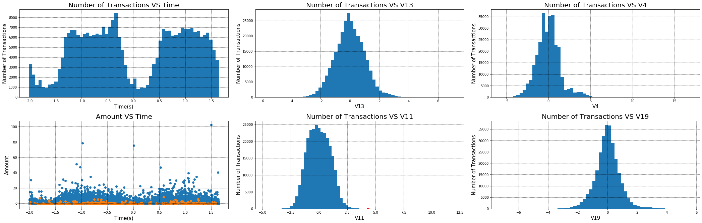
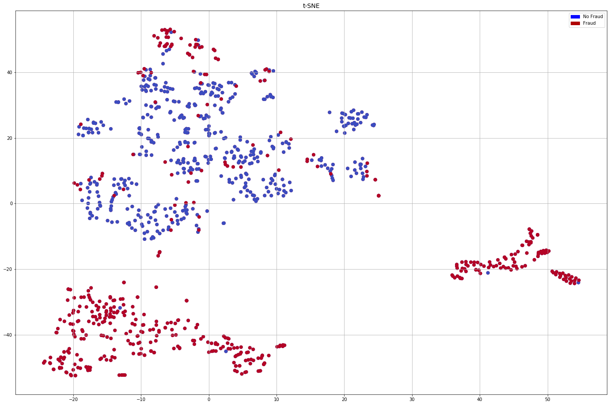
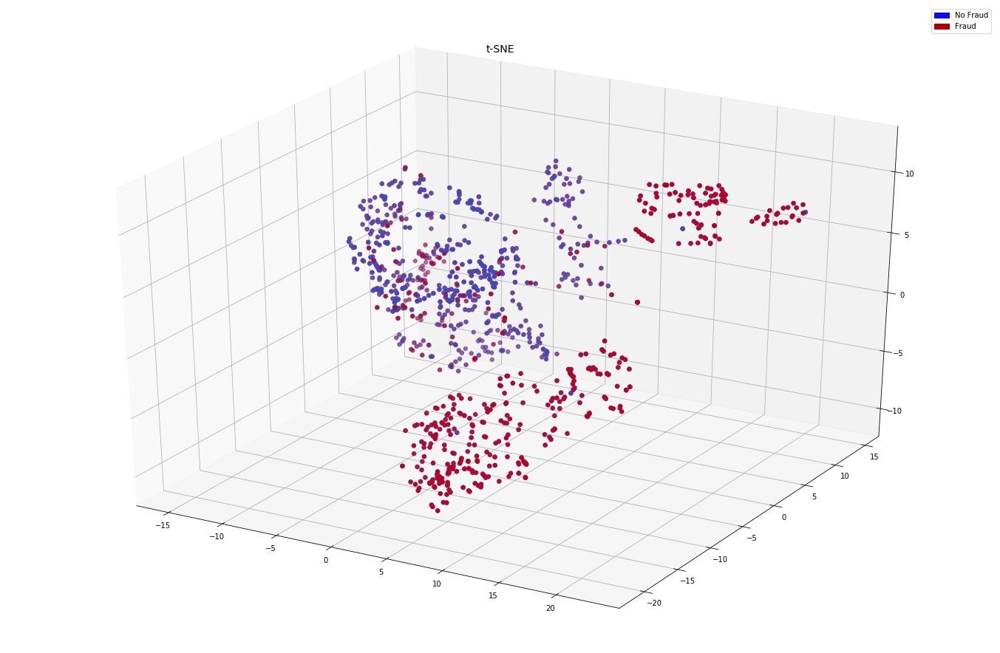

# Credit Card Fraud Detection

The classification of fraudulent credit card transactions using Tensorflow 2.0's API

## The Data: Credit Card Transactions 

The dataset contains transactions made by credit cards in September 2013 by european cardholders. It presents transactions that occured over two days,
where 492 of 284,807 transactions were fraudulent. It is a highly unbalanced dataset, and therefore, this was the real challenge. The positive class (frauds), 
only account for 0.172% of all the transactions made. 

It only contains numerical input variables, which are the result of a PCA transformation. This is due to confidentiality issues. The original information 
on the data cannot be provided. 

Features V1, V2, ..., V28 are the principal components obtained with PCA. The only features that haven't been transformed are "time" and "amount". The "time" 
feature contains the seconds elapsed between each transaction and the first transaction in the dataset. "Amount" is the transaction amount, this feature can be
used for example-dependent cost-sensitive learning. 

Feature "class" is the response variable that takes a binary 1 (fraud transaction) or 0 (valid transaction). 

Data reference: https://www.kaggle.com/mlg-ulb/creditcardfraud

## Data Distributions 

Below is a basic plot of the distribution of the data. They components V1, V2, ..., V28 follow similar distributions. The "Amount" and "Time" features are 
distributed differently over time. 



## Undersampling and t-SNE

The main catch here was to balance that data in a way that encouraged the visual separation between valid and fraud transactions. In order to do so, I used 
"Under-sampling with Cluster Centroids". The documentation can be found here: 

https://imbalanced-learn.readthedocs.io/en/stable/generated/imblearn.under_sampling.ClusterCentroids.html

After that, I visualized that data in 2D and 3D with t-SNE. It gave a really good idea about the separation of the data. The following could be seen:

<p align = 'center'>


</p>

## Neural Network and Classification

In order to classify, I used the following parameters on my Neural Network. It was built with Tensorflow 2.0. 

```python
self.model = keras.Sequential([
            keras.layers.Dense(units = dense1, input_dim = input, activation = 'relu'),
            keras.layers.Dense(units=dense2, activation='relu'),
            keras.layers.Dense(units=dense3, activation='sigmoid')
        ])
```

In the main function: 

```python
model = NNClassifier(2, 15, 15, 1)
## Compoling the model
model.compile(optimizer= optimizers.SGD(learning_rate = 0.0001),
              loss = tf.losses.MeanSquaredError(),
              accuracy_metric = ['accuracy'] )
## Training and recording history
history = model.train(X_train, y_train, epochs = 1000,  batch_size = 32, validation_split = 0.2)
```

The metric I used for accuracy was "accuracy_score". The following results could be seen. I am still working on making the training more consistent and 
stable. There are often different results for the same parameter, but the training is relatively stable so far. 

<p align = 'center'>


</p>
